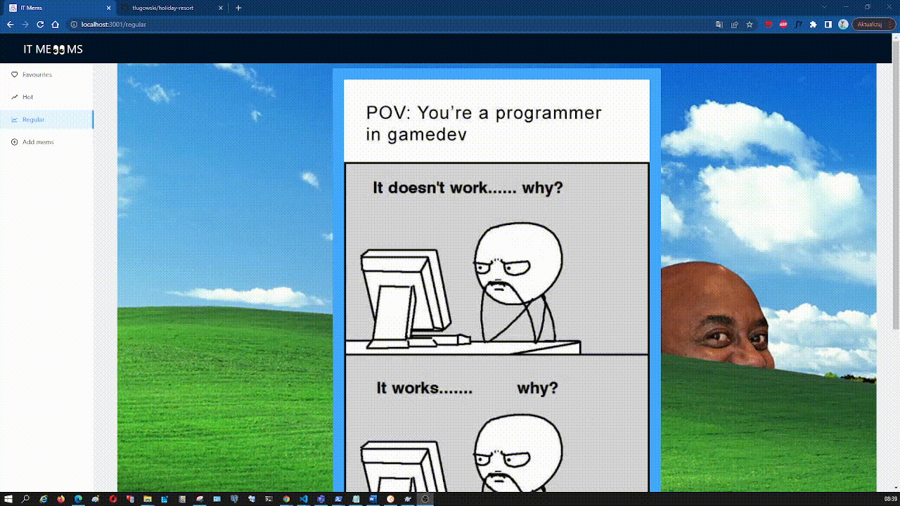
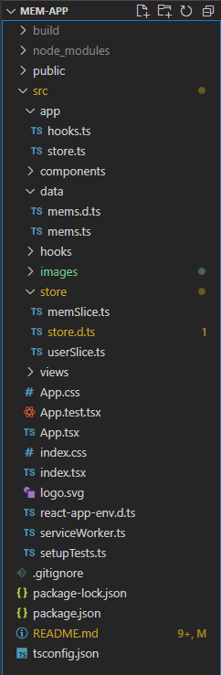

# IT Mems 

The application is used to display and add IT-themed memes. Memes can be added using links. You can add paws up and down. We have a section Hot, Regular, Favorites. Each meme has a rate

## Project requirements

1. Application should contain route '/hot' and '/regular'.
2. memes with number (upvote - downvote > 5) are to go to route '/hot', all others are
   others are on '/regular'.
3. add simple menu to switch between sections.
4. the meme base is to be fixed. Recommended character array:

[
{
title: "Mem 1",
upvotes: 6,
downvotes: 0,
img: "path/to/image1.png"
},
{
title: "Mem 2",
upvotes: 1,
downvotes: 2,
img: "path/to/image2.png"
},
....
]

5. create a Mem component that displays the title, the number of upvotes/downvotes, and possibly an image,
   and controls for clicking upvote, downvote.
6. Generate a list from the Mem component and display in '/hot' and '/regular'.
7. Filter the mem database list on the appropriate routers according to the rules in point 2.
8. filtering should work "live". Example: if I click downvote and (upvote - downvote)
   gives 5, the meme should disappear from the list displayed on HOT.
9. if I am on route '/hot' the 'HOT' button should be different from 'REGULAR' and
   vice versa.
10. meme list should be scrollable
11. meme should be marked with an asterisk (new field required in meme database).
    12**. Add an extra route with a form to add a meme.
    This \* can be a downlow image (given by a link, or saved on disk and given
    as a path). Optionally you can display only the meme title instead of the image.
    ** optional task
    Additional Values:
12. the application description and launch instructions in README.md.
13. the code is clean and uniformly formatted.
14. elegant styling of the application.
    Use of Redux.
    

## Features

- Viewing memes
- Thumbs up and thumbs down
- Add and delete memes to favourites
- Each meme has a rate
- Add your own meme using the link

### HomePage

Home page containing the main page description
You can easily navigate to the page by clicking on the

### Favourites

With the Add to favourite button you can add a meme to the favourites section. With the Delate button you can delete this meme. The isFavourite label allows you to show whether the current meme is a favourite or not

### Regular

Regular section displays all default memes

### Hot

The Hot section displays all the memes that have been previously added from another section with +5 thumbs up

### Add mems

The Add mems section allows you to add a meme by using a link to the image. It has 3 required fields - the minimum number of characters that must be entered is 5. In case of a smaller number of characters a warning message appears. When the meme is added correctly, a success message appears and the added picture appears in the regular section

### Not Found Page

In case you enter an address that is not one of the root ones - a served 404 error page will appear

## Architecture

The project is separated into a separate folder:

- App - the main application folder
- Components - containing the main functional components reusable in the whole application
- Data - contains the database and its service
- Hooks - containing hook for handling the change of screen width
- images - images and gifs of the project
- store - files connected with Redux
- views - components related to displaying individual pages.

  

Split folders by style:
Components have their own twin file with 'components.ts' containing the component's styles and being exported at the same level as the file that uses it.

## Database

The database is located in the `mems.ts` file
by a file in json format and controlled by types and interfaces.

## Technologies

- React - TypeScript
- Redux
- Andt design
- Styled components
- aos - for effects
